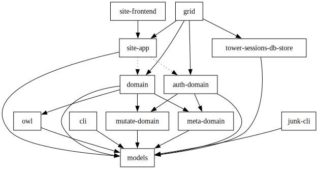

# rambit

Welcome to the `rambit` monorepo. Feel free to look around.

## Development

### Setup

We use [Nix](https://nixos.org/) for dev shells, enabled by [`direnv`](https://direnv.net/).
You should have both of these installed, and you should have the
[flake features](https://nixos.wiki/wiki/flakes) enabled for your Nix
installation.

If all is well, enter the project directory and `direnv` should complain about
the `.envrc` being untrusted. Trust it with `direnv allow` (I mean, take a peak
if you want), and nix will begin to build the devshell. When that's complete,
you should have a shell with all the necessary dependencies available. The
devshell will also come with custom commands, which you can explore with the
`menu` command.

### Contributing
- We adhere to the [Conventional Commits](https://www.conventionalcommits.org/en/v1.0.0/) specification. We don't care so much about strict commit types, but include the crates you touch or `flake` or `deps` in the scope position.
- Before submitting a PR, run the `check` command (an alias of `nix flake check -L`). This will test many things, and will also be run in CI.
- If first-party crate dependencies are modified, run `update-crate-graph` to update the crate graph SVG at `media/crate-graph.svg`. CI will fail if it's out-of-date.

## Crate Map

- `app` - server binary entrypoint.
- `models` - primary db model types.
- `prime-domain` - centralized, dependency-injected business logic.

## License

This project is licensed under the GNU GPL-3.0 license. 

- See the [LICENSE](./LICENSE) file for the full GNU GPL-3.0 license text.

As of this moment, this workspace is not published on [crates.io](https://crates.io) so the cargo license metadata is not populated. This has no bearing on the licensing of the code.

